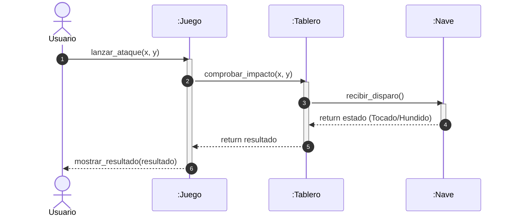

```mermaid
sequenceDiagram;
autonumber
    actor Usuario
    participant Juego as :Juego
    participant Tablero as :Tablero
    participant Nave as :Nave

    Usuario->>Juego: lanzar_ataque(x, y)
    activate Juego
    
    Juego->>Tablero: comprobar_impacto(x, y)
    activate Tablero
    
    Tablero->>Nave: recibir_disparo()
    activate Nave
    Nave-->>Tablero: return estado (Tocado/Hundido)
    deactivate Nave
    
    Tablero-->>Juego: return resultado
    deactivate Tablero
    
    Juego-->>Usuario: mostrar_resultado(resultado)
    deactivate Juego
```