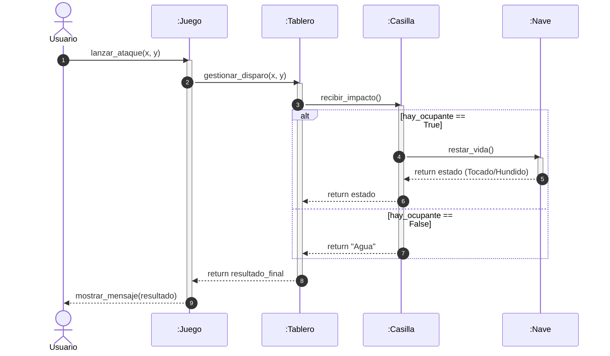

```mermaid
sequenceDiagram;
autonumber
actor Usuario;
participant Juego as :Juego;
participant Tablero as :Tablero;
participant Casilla as :Casilla;
participant Nave as :Nave;

    Usuario->>Juego: lanzar_ataque(x, y);
    activate Juego;
    
    Juego->>Tablero: gestionar_disparo(x, y);
    activate Tablero;
    
    Tablero->>Casilla: recibir_impacto();
    activate Casilla;
    
    alt hay_ocupante == True
        Casilla->>Nave: restar_vida();
        activate Nave;
        Nave-->>Casilla: return estado (Tocado/Hundido);
        deactivate Nave;
        Casilla-->>Tablero: return estado;
    else hay_ocupante == False
        Casilla-->>Tablero: return "Agua";
    end;
    
    deactivate Casilla;
    Tablero-->>Juego: return resultado_final;
    deactivate Tablero;
    
    Juego-->>Usuario: mostrar_mensaje(resultado);
    deactivate Juego;
```